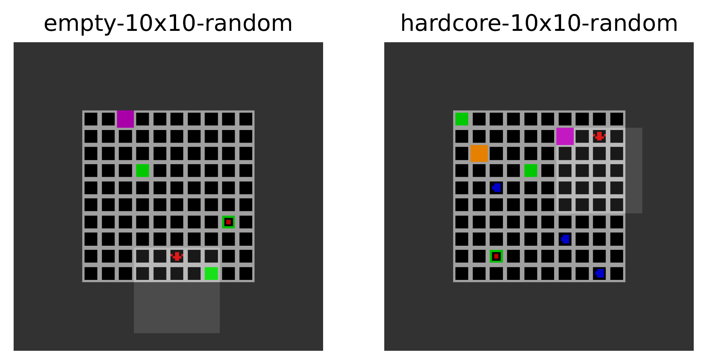
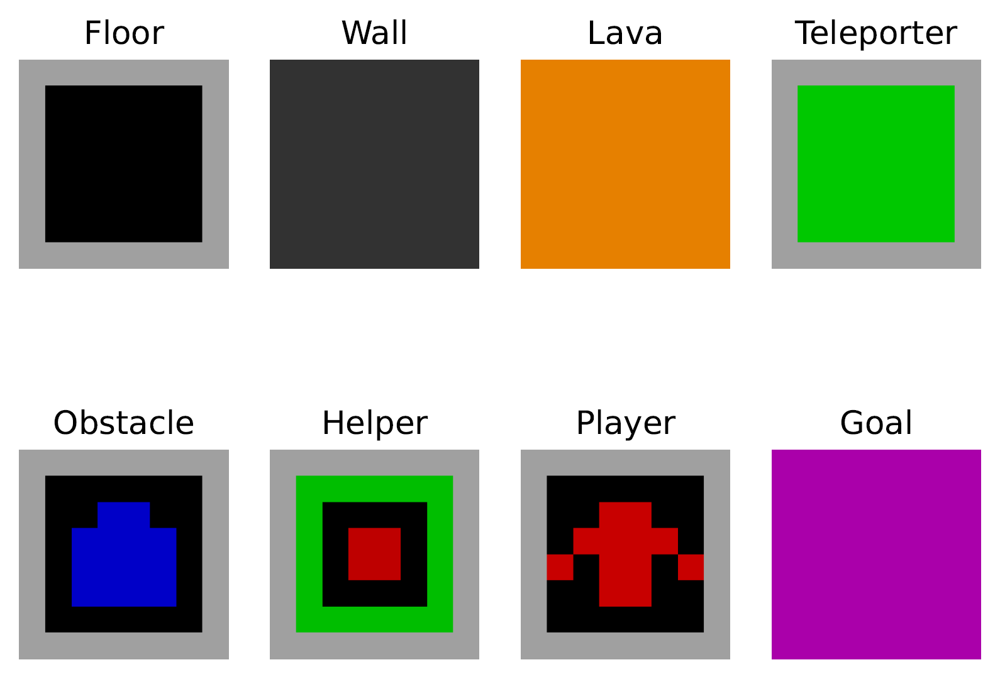

# RL-environment-Gridworld
[](https://github.com/psf/black)


A small gridworld environment for reinforcement learning. This environment is lightweight and completely randomized. 

The work this environment was created for can be found [here](https://github.com/Frederik-L/evaluating-population-based-reinforcement-learning-for-transfer-learning).

## Requirenments: 
- Python 3.7+
- NumPy 
- Matplotlib (optional)

## Usage
Currently, there are three different environment ids:
- ```empty-10x10``` an empty 10x10 test world used for debugging, no randomness here
- ```empty-10x10-random``` an empty 10x10 test world with all objects random placed
- ```hardcore-10x10-random``` a 10x10 world with all objects placed



Example world creation:
```
import matplotlib.pyplot as plt

gw = Gridworld.make("hardcore-10x10-random")
plt.imshow(gw.render())
plt.show()

gw = Gridworld.make("empty-10x10-random")
plt.imshow(gw.render())
plt.show()

gw = Gridworld.make("empty-10x10")
plt.imshow(gw.render())
plt.show()
```

The gridworld is fully parameterized and can be modified:

```
@params:
       grid_size: int the size of the playable grid (square)
       observation_size: int = the size of the observation, only odd observation sizes allowed
       random: bool if True all objects are placed random
       seed: Any sets the seed for the gridworld, if None: int(time.time()) will be the seed
       obstacles: bool if True lava and obstacles will be placed random
       max_steps: int  number of allowed steps before run fails
       num_obstacles: int number of moving obstacles
       
       
env = "empty-10x10-random"

env = Gridworld(
                grid_size=10,
                observation_size=5,
                random=True,
                seed=seed,
                obstacles=True,
                max_steps=200,
                num_obstacles=3
            )
```

### Tiles


There are eight different types of tiles:
- ```Floor``` a walkable tile with no special effect
- ```Wall``` an impassable tile surrounding the map
- ```Lava``` a passable tile ending the game
- ```Teleporter``` teleports the player to the other teleporter tile
- ```Obstacle``` random moving obstacles lowering the reward
- ```Helper``` increasing the reward
- ```Player``` the player tile always at the bottom center of the observation
- ```Goal``` the goal tile

### Actions
There are three different actions in this gridworld environment:
- 0 = forward
- 1 = turn left
- 2 = turn right

More information found in the linked paper.

## List of publications:
- [Evaluating Population based Reinforcement Learning for Transfer Learning](https://github.com/Frederik-L/evaluating-population-based-reinforcement-learning-for-transfer-learning) (2021)

Please use the bibtex for the work this environment was created if you want to cite this repository in your publications:
```
@misc{pbt-transfer,
  author = {Liebig, Jan Frederik},
  title = {Evaluating Population based Reinforcement Learning for Transfer Learning},
  year = {2021},
  howpublished = {https://github.com/Frederik-L/evaluating-population-based-reinforcement-learning-for-transfer-learning},
}
```
